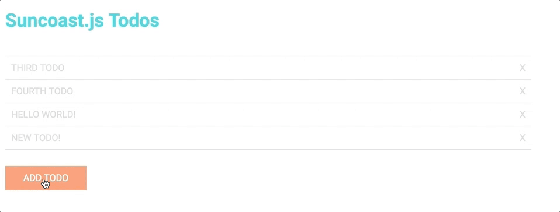

# Suncoast.js Full Stack JavaScript Workshop

This is the Full Stack JavaScript Workshop curriculum for June 29th, 2017.

There are 12 parts that you can navigate to using the tags so that you can follow along and progress from each part.

This is a very ambitious workshop, meaning, we may not get through all of it in the actual time frame but you can take it home and complete it on your own.

This finished product will look a little something like this:

